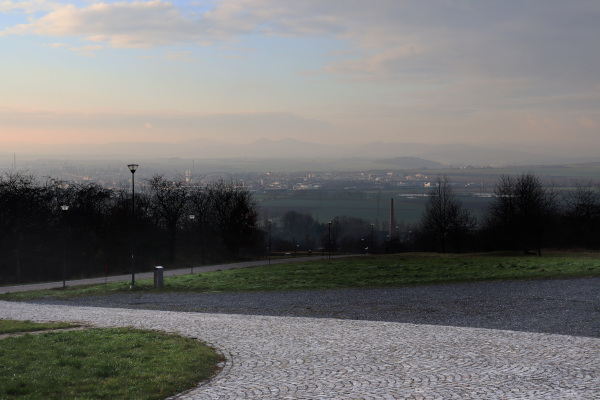

# TisTrain
On-line kroužek všestranného cvičení pro kluky

<strong style="color: green;">Tato stránka teprve vzniká, určitě se můžete těšit na vylepšení!</strong>

## Aktivita pro tento týden
* Najděte si hřiště s basketbalovým košem.
* Zkuste během týdne alespoň 40× hodit na basketbalový koš.
* Je jedno, jakým míčem — klidně hažte tenisákem nebo třeba zmačkejte staré noviny a vyrobte si „míč“ z něj. Ale věřím, že nějaký míč najdete.

## Vycházka pro tento týden (pro cvičence z&nbsp;Uherského Hradiště)?
* Byli jste někdy na Rochusu? Asi jo. Jestli už je to dávno, nebo jste tam nebyli, zkuste se tam vypravit.
### Parkování
* Parkovat lze například u&nbsp;Kauflandu. 
* Malé parkoviště je u vodárenské věže pod Rochusem, ale to může být obsazené a&nbsp;je před ním velký kopec — pozor na náledí).
### Mapa
* Mapa je tady: https://mapy.cz/s/horubopuda

## Chcete se potkat či komunikovat alespoň on-line?
* Připravujeme možnost on-line setkávání — vydržte!
