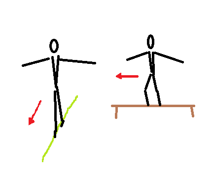
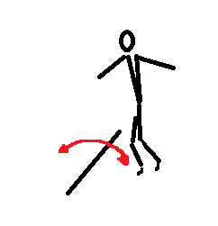
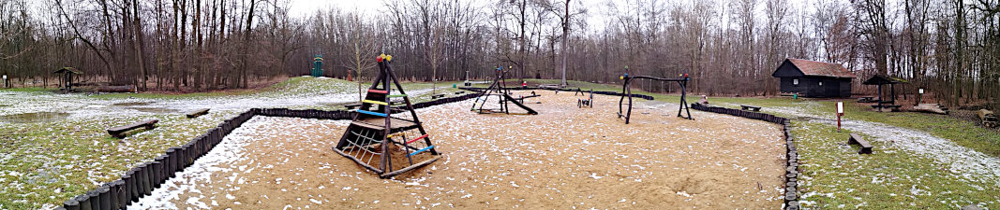

# TisFit od 25. února 2021
Tipy na pohybové aktivity nejen v Uh. Hradišti zejména pro děti (každého věku).

<strong style="color: red; background-color: yellow">
Tato stránka není nabídkou tréninkového programu. Pokud se necháte inspirovat, vždy přihlédněte k&nbsp;dlouhodobému i&nbsp;aktuálním zdravotnímu stavu a&nbsp;aktuální situaci. Respektujte vládní opatření, buďte ohleduplní ke svému okolí a&nbsp;respektujte práva ostatních!
</strong>

## 1. Cvičení venku &mdash; provazochodci
* Sníh zmizel a&nbsp;začalo jarní počasí. Pojďme ho využít a&nbsp;zahrát si na „provazochodce“. Trénovat jde skoro kdekoli.

### A) Chůze po čáře
- Čar najdete všude spousta. Na vašem oblíbeném hřišti jsou obvodové čáry. Na chodníku je spára mezi dlaždicemi. Najděte čáru a&nbsp;zkuste chvíli jít jen po ní.

### B) Chůze po obrubníku
- Najděte si přiměřeně široký obrubník a&nbsp;zkuste jít chvíli po něm.
- Prosím, nešlapte přitom po trávnících a&nbsp;nepošlapejte do záhonků! Děkuji!

### C) Chůze po kládě
- Kde najdete kládu? V&nbsp;lese určitě. Ale můžete využít také různé překážky na dětských či workoutových hřištích.
- Prosím, nešlapte po zídkách ani po lavičkách. Někdo si na ně bude chtít sednout.

### Na co si dát pozor!
1. Před cvičení zpevněte bříško dlouhým výdechem „Ššššššš!“. Pak už volně dýchejte, ale bříško zůstane pevné. 
2. Hlídejte si, abyste našlapovali třemi body chodidla — patou, bříškem pod palcem a&nbsp;bříškem pod malíčkem. Na všech třech bodech bode stejná váha.
3. Kolena by měla být nad kotníky, nevytáčejte kolena do stran.

## 2. Cvičení doma &mdash; poskoky
* Každý den si napočítejte 30&nbsp;poskoků. Můžete si je rozdělit na několik částí.
* Položte si na zem provázek nebo tužku a&nbsp;přeskakujte.
- Kdo chce cvik těžší, může přeskakovat krabičku od margarínu či od jogurtu.
* **Nedupejte!** Doskok by měl být plynulý! Sousedi pod vámi nesmí vědět, že cvičíte!

## 3. Vycházka: hřiště v&nbsp;Kunovském lese (Uherské Hradiště)

<strong style="color: red; background-color: yellow">
POZOR! Prosím, dodržujte veškerá vládní opatření. Choďte jen v&nbsp;počtu, který aktuální opatření dovolují, snažte se nepotkávat se s&nbsp;dalšími. Noste roušky či respirátory tam, kde je větší pohyb lidí. Cíle volíme tak, aby byli v&nbsp;přírodě v&nbsp;místech, kde je pohyb lidí menší. Ale v&nbsp;hezkých dnech samozřejmě vyráží do přírody hodně lidí, respektujte se navzájem a&nbsp;buďte opatrní!
</strong>

### Cíl

<iframe style="border:none" src="https://frame.mapy.cz/s/nezumaroge" width="400" height="280" frameborder="0"></iframe>
- https://mapy.cz/s/fahemefeko

### Co tam?
- Zkuste obejít pískoviště po jeho obvodu a&nbsp;nespadnout.
- Máte tu také hrazdičky.

### Co počasí a&nbsp;počet lidí?
- Až na paseku v&nbsp;Kunovském lese se dostanete po asfaltu.
- Je pravda, že na asfaltové cestě bývá za hezkého počasí dost lidí a&nbsp;cyklist. Ale vyhnete se.

### Parkování
- https://mapy.cz/s/javazegelo
- Parkoviště ve Štěpnicích bývají obsazené, doporučujeme tedy zastavit hned za podjezdem pod tratí na parkovišti u&nbsp;nemocnice. 

## Chcete se potkat či komunikovat alespoň on-line?

### Společné on-line rozcvičky ve čtvrtek
- Každý čtvrtek od 17:45.
- Sejdeme se na adrese: https://meet.google.com/zpr-gwpu-dpa
- Stačí libovolný prohlížeč a&nbsp;reproduktor. Mikrofon nepotřebujete.

### Slack pro novinky a společnou diskusi
- Můžete se přidat do týmu v rámci aplikace Slack. Slack je obdoba Messengeru, ale není svázána s&nbsp;žádnou sociální sítí a&nbsp;nevyžaduje vytvoření klasického účtu, stačí zadat jen e-mail.
- Odkaz pro přidání je zde: 
https://join.slack.com/t/tisfit/shared_invite/zt-mqhvuxps-BDaZZ8jwNGXbvjdNCjF8eA
- Slack můžete používat v&nbsp;prohlížeči nebo si můžete nainstalovat aplikaci do počítače či mobilu.
- Můžete se pochlubit, jak vám jde plnění aktivit, dát ostatním tipy, nebo prostě jen sdílet radost z&nbsp;pohybu. Záleží jen na vás.

## Co je TisFit?
* Stránka vznikla původně pro cvičence Sokola Uherské Hradiště jako dílčí kompenzace za podzim 2020, kdy cvičení v&nbsp;tělocvičně vládní opatření neumožňovala.
* Naše tipy na cvičení ale nabízíme všem bez rozdílu. Přidejte se, sdílejte, šiřte! Jsme tu pro radost z&nbsp;pohybu a&nbsp;máme radost, že s&nbsp;námi cvičíte!
