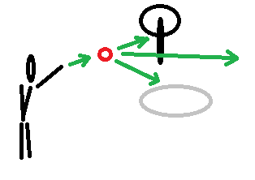

# TisFit pro týden od 15. února 2021
Tipy na pohybové aktivity nejen v Uh. Hradišti zejména pro děti (každého věku).

<strong style="color: red; background-color: yellow">
Tato stránka není nabídkou tréninkového programu. Pokud se necháte inspirovat, vždy přihlédněte k&nbsp;dlouhodobému i&nbsp;aktuálním zdravotnímu stavu a&nbsp;aktuální situaci. Respektujte vládní opatření, buďte ohleduplní ke svému okolí a&nbsp;respektujte práva ostatních!
</strong>

## 1. Aktivita pro tento týden
* Máme tu sníh a&nbsp;zatím vypadá, že drží.
* Použijte ho k&nbsp;tvorbě sněhových koulí. Ale pozor, nebudeme házet po kamarádech ani sourozencích!
* Zkuste tyto disciplíny:
    - Zásah stromu: zkuste, z&nbsp;jaké největší vzdálenosti zasáhnete strom alespoň na 3 z&nbsp;5 pokusů.
    - Hod na plochý cíl: vyznačte si ve sněhu kruh a&nbsp;snažte se trefit sněhovou koulí do něj.
    - Hod na dálku: zkuste, kam nejdál dohodíte. Můžete si vzdálenost odkrokovat, nebo soutěžit s&nbsp;kamarádem či sourozencem.
    - Hod pod jednou nohou: zvedněte jednu nohu a zkuste hodit tak, aby koule letěla pod nohou. A&nbsp;pozor, ať při tom nespadnete! ;)
    - Hod druhou rukou: zapojte i&nbsp;svoji druhou ruku. Vyzkoušejte všechny disciplíny. Nejprve vám to asi nepůjde, ale zlepšíte se!

## 2. Výzva pro tento týden &mdash; cvičení doma
* Tento týden zkuste každý den 10 sed-lehů.
* Nohy nechte volně, nezapírejte si je, ať si zacvičí i&nbsp;vaše bříško.

## 3. Vycházka pro tento týden (pro cvičence z&nbsp;Uherského Hradiště)?
* Byli jste někdy na Rochusu? Asi jo. Jestli už je to dávno, nebo jste tam nebyli, zkuste se tam vypravit!

<strong style="color: red; background-color: yellow">
POZOR! Prosím, dodržujte veškerá vládní opatření. Choďte jen v&nbsp;počtu, který aktuální opatření dovolují, snažte se nepotkávat se s&nbsp;dalšími. Noste roušky či respirátory tam, kde je větší pohyb lidí. Cíle volíme tak, aby byli v&nbsp;přírodě v&nbsp;místech, kde je pohyb lidí menší. Ale v&nbsp;hezkých dnech samozřejmě vyráží do přírody hodně lidí, respektujte se navzájem a&nbsp;buďte opatrní!
</strong>

### Parkování
* Parkovat lze například u&nbsp;Kauflandu. 
* Malé parkoviště je u vodárenské věže pod Rochusem, ale to může být obsazené a&nbsp;je před ním velký kopec — pozor na náledí).
### Co počasí?
* Až k&nbsp;budově Muzea v&nbsp;přírodě Rochus se dostanete „suchou nohou“. Dále ke kapli Sv. Rocha vede široká zpevněná cesta, která také bývá v&nbsp;pohodě schůdná. Ostatní cestičky už bývají hliněné, tam už zvažte dle aktuální nálady, obuvy a&nbsp;po dohodě s&nbsp;rodiči.
### Mapa
* Mapa je tady: https://mapy.cz/s/horubopuda
### Tip: Můžete si po cestě zkusit i&nbsp;[sokolský „korienťák“](https://sites.google.com/sokol.eu/hradistsky-korientak/korien%C5%A5%C3%A1k-2) &mdash; ale pozor, je-li bláto, bude to trochu horší.

## Chcete se potkat či komunikovat alespoň on-line?

### Slack pro novinky a společnou diskusi
- Můžete se přidat do týmu v rámci aplikace Slack. Slack je obdoba Messengeru, ale není svázána s&nbsp;žádnou sociální sítí a&nbsp;nevyžaduje vytvoření klasického účtu, stačí zadat jen e-mail.
- Odkaz pro přidání je zde: 
https://join.slack.com/t/tisfit/shared_invite/zt-mqhvuxps-BDaZZ8jwNGXbvjdNCjF8eA
- Slack můžete používat v&nbsp;prohlížeči nebo si můžete nainstalovat aplikaci do počítače či mobilu.
- Můžete se pochlubit, jak vám jde plnění aktivit, dát ostatním tipy, nebo prostě jen sdílet radost z&nbsp;pohybu. Záleží jen na vás.

### Společné on-line rozcvičky ve čtvrtek
- Máte-li chuť, přijďte se rozcvičit ve čtvrtek v 17:45.
- Odkaz pro připojení zveřejníme v aplikaci Slack zhruba 15&nbsp;minut předem.
- Pro dnes ji dáváme i sem: https://meet.google.com/zpr-gwpu-dpa

## Co je TisFit?
* Stránka vznikla původně pro cvičence Sokola Uherské Hradiště jako dílčí kompenzace za podzim 2020, kdy cvičení v&nbsp;tělocvičně vládní opatření neumožňovala.
* Naše tipy na cvičení ale nabízíme všem bez rozdílu. Přidejte se, sdílejte, šiřte! Jsme tu pro radost z&nbsp;pohybu a&nbsp;máme radost, že s&nbsp;námi cvičíte!
