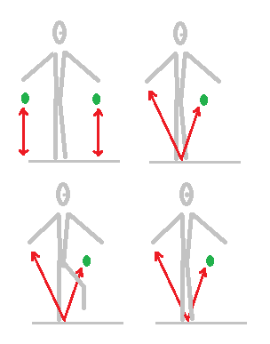
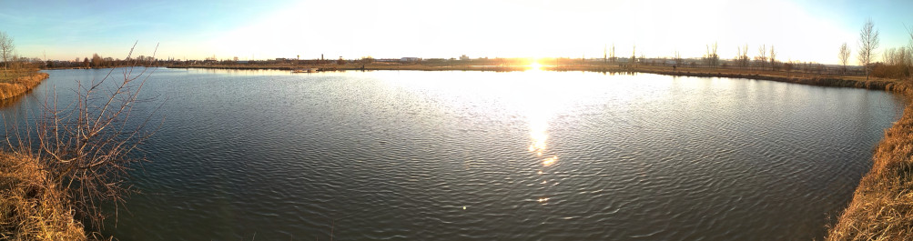

# TisFit od 1. dubna 2021
Tipy na pohybové aktivity zejména pro děti (každého věku).

<strong style="color: red; background-color: yellow">
Tato stránka není nabídkou tréninkového programu. Pokud se necháte inspirovat, vždy přihlédněte k&nbsp;dlouhodobému i&nbsp;aktuálním zdravotnímu stavu a&nbsp;aktuální situaci. Respektujte vládní opatření, buďte ohleduplní ke svému okolí a&nbsp;respektujte práva ostatních!
</strong>

## 1. „Školka s&nbsp;tenisákem“
- Venku je krásně, tak si najdi rovný betonový plácek a&nbsp;pojď si pohrát s míčkem (je jedno, jaký míč použiješ, ale měl by se dobře odrážet).

### A) Odraz o&nbsp;zem
- Hoď míčkem o&nbsp;zem a&nbsp;chyť ho.
- Trénuj obě ruce stejně
- Můžeš míček odrazem o&nbsp;zem házet z&nbsp;pravé ruky do levé a naopak.

### B) Odraz pod nohou
- Přidáme rovnováhu: zvedni jednu nohu a&nbsp;hoď míček pravou rukou o&nbsp;zem tak, aby se odrazil pod nohou. Chyť ho druhou rukou.
- Střídej oba směry.
- O&nbsp;něco těžší je chytit míček stejnou rukou &mdash; noha přitom nemusí být stále na stejném místě.

### C) Odraz za zády
- Zkus hodit míček odrazem od země z&nbsp;levé ruky do pravé, ale tak, aby se odrazil za tvými zády, nikoli před tebou.

### D) Odraz s&nbsp;obratem
- Jsme ve finále &mdash; zkus míček odrazit od země, otočit se dokola a&nbsp;poté míček chytnout, než spadne na zem.
- Kdo je rychlý, může si sednout a&nbsp;vstát, než míček spadne.
- Nejrychlejší si zkusí i&nbsp;lehnout &mdash; ale to zkoušej někde, kde je sucho a&nbsp;čisto.

### Na co si dát pozor!
S&nbsp;míčkem si hrej na hřišti, kde nejezdí auta ani cyklisté a&nbsp;kde nehrozí srážka s&nbsp;chodci!

## 2. Vycházka: jezero za Baťovým kanálem (Uherské Hradiště/Staré Město)

<strong style="color: red; background-color: yellow">
POZOR! Prosím, dodržujte veškerá vládní opatření. Choďte jen v&nbsp;počtu, který aktuální opatření dovolují, snažte se nepotkávat se s&nbsp;dalšími. Noste roušky či respirátory tam, kde je větší pohyb lidí. Cíle volíme tak, aby byli v&nbsp;přírodě v&nbsp;místech, kde je pohyb lidí menší. Ale v&nbsp;hezkých dnech samozřejmě vyráží do přírody hodně lidí, respektujte se navzájem a&nbsp;buďte opatrní!
</strong>

Odkaz na Mapy.cz: https://mapy.cz/s/kumarogofa

### Co tam?
- V&nbsp;těchto dnech tam můžete pozorovat labutě.
- Po cestě můžete zkusit na poli hod hroudou hlíny &mdash; ale nešlapte po poli!
- Poznáte, jaké stromy kolem jsou nasazeny.
- Na některých stromech můžete najít stopy bobřích zkoubků.

### Co počasí a&nbsp;počet lidí?
- Po pevné cestě se dostanete blízko k&nbsp;jezeru, posledních cca 100&nbsp;metrů už musíte po pěšince. Pokud znovu nenaprší, tak dnes už jsou pěšinky většinou obeschlé.
- Bohužel, u&nbsp;mola a&nbsp;pláže dnes potkáte lidí hodně. Ale místa je dost a&nbsp;lze udržet přiměřený odstup.

### Parkování
- Nejsnáze zaparkujete na parkovišti nákupního centra ve Starém Městě.  
- Odkaz na Mapy.cz: https://mapy.cz/s/bokopopuvo

## Chcete se potkat alespoň on-line?

### Společné on-line rozcvičky každý čtvrtek 17:45
- Připojte se pomocí odkazu odkazu: https://meet.google.com/zpr-gwpu-dpa
- Stačí libovolný prohlížeč a&nbsp;reproduktor. Mikrofon nepotřebujete. Funguje i&nbsp;v&nbsp;mobilu.

### Napište nám do diskuse
- Napište, co se vám líbí! Budeme vědět, že naše činnost má smysl!
- Diskuse: https://github.com/e-m-s/TisFit/discussions/1

### Slack pro novinky a společnou diskusi
- Můžete se přidat do týmu v rámci aplikace Slack. Slack je obdoba Messengeru, ale není svázána s&nbsp;žádnou sociální sítí a&nbsp;nevyžaduje vytvoření klasického účtu, stačí zadat jen e-mail.
- Odkaz pro přidání je zde: 
https://join.slack.com/t/tisfit/shared_invite/zt-mqhvuxps-BDaZZ8jwNGXbvjdNCjF8eA
- Slack můžete používat v&nbsp;prohlížeči nebo si můžete nainstalovat aplikaci do počítače či mobilu.
- Můžete se pochlubit, jak vám jde plnění aktivit, dát ostatním tipy, nebo prostě jen sdílet radost z&nbsp;pohybu. Záleží jen na vás.

## Co je TisFit?
* Stránka vznikla původně pro cvičence Sokola Uherské Hradiště jako dílčí kompenzace za podzim 2020, kdy cvičení v&nbsp;tělocvičně vládní opatření neumožňovala.
* Naše tipy na cvičení ale nabízíme všem bez rozdílu. Přidejte se, sdílejte, šiřte! Jsme tu pro radost z&nbsp;pohybu a&nbsp;máme radost, že s&nbsp;námi cvičíte!
