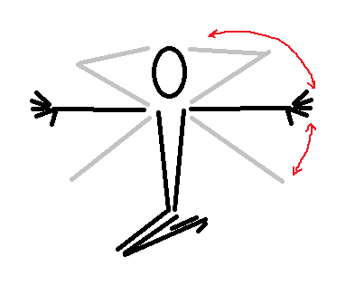
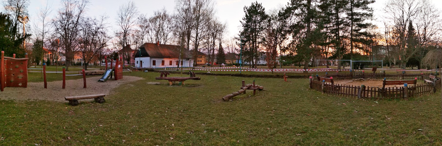

# TisFit od 4. března 2021
Tipy na pohybové aktivity zejména pro děti (každého věku).

<strong style="color: red; background-color: yellow">
Tato stránka není nabídkou tréninkového programu. Pokud se necháte inspirovat, vždy přihlédněte k&nbsp;dlouhodobému i&nbsp;aktuálním zdravotnímu stavu a&nbsp;aktuální situaci. Respektujte vládní opatření, buďte ohleduplní ke svému okolí a&nbsp;respektujte práva ostatních!
</strong>

## 1. Cvičení venku &mdash; „Tarzan“
- Minulý týden jsme trénovali rovnováhu. Tentokrát si naši pozornost zaslouží ruce a&nbsp;trup.
- Najděte si vhodnou prolézačku na dětském hřišti či hrazdičku na workoutovém hřišti a&nbsp;jdeme na to! ;) 

### A) Ručkování
- Najděte si tyč, za kterou se můžete zavěsit rukama a&nbsp;přeručkovat na druhou stranu.
- Nejsnáze ji najdete na nejbližším hřišti. Na starších sídlištích najdete i&nbsp;rámy pro zavěšení šňůr na prádlo.
- Menším dětem pomohou rodiče.
- Pokud to zvládáte, můžete zkusit těžší variantu, kdy zadní ruka přehmatává před přední. Snazší je varianta, kdy je jedna ruka stále vepředu a&nbsp;posunujete se po malých kouscích.

### B) Ručkování na všech čtyřech &mdash; **jen pod dozorem rodičů**
- Pokud je pro vás ručkování pouze rukama moc těžké, můžete se zavěsit i&nbsp;nohama. Je to snazší, ale dělejte to jen pod dozorem rodičů!

### C) „Medvěd brtník“
- Mnoho prolézaček na hřištích má svislé tyče. Zkuste se na některou z&nbsp;nich zavěsit a&nbsp;poproste někoho, ať vám stopne, jesti vydržíte 10, 20 či 30 sekund.
- Můžete k&nbsp;tomu využít i&nbsp;strom, ale prosím, pouze stromy s&nbsp;pevným kmenem, který nepoškodíte ani mu nezlomíte větev.

### D) Polovýmyky
- Zkuste si najít tyč, která může fungovat jako hrazda.
- Zvedněte obě kolena až k&nbsp;tyči a&nbsp;pak je zase pomalu spusťte.
- Lehčí varianta je tehdy, když je tyč nízko, abyste mohli stát nohama na zemi.

### Na co si dát pozor!
1. Zkuste i&nbsp;ve visu mít zpevněná ramena a&nbsp;neviset pasivně. Mezi pažemi a&nbsp;ušima by mělo být kousek volného místa.
2. Je-li tyč dost úzká, snažte se držet palec proti ostatním prstům. Úchop je tak pevnější. Ale na širších tyčích to asi nezvládnete.

## 2. Cvičení doma &mdash; „sluníčko“
- Předpověď nám na tento týden moc sluníčka neslibuje, tak si paprsky sluníčka zkusíme vyčarovat alespoň z&nbsp;rukou. A&nbsp;ještě přitom protáhneme a&nbsp;posílíme záda.

### Základní poloha
- Sedněte si na židli či na paty a&nbsp;srovnejte záda.
- Ramena stáhněte dolů, bradu mírně přitáhněte k&nbsp;hrudníku, temeno hlavy vytáhněte nahoru.

### Upažte dolů
- Dejte paže šikmo dolů, dlaně vpřed, prsty roztáhněte co nejvíc dokážete.
- Prsteníčky vytáhněte do dálky, jako byste s&nbsp;nimi chtěli dosáhnout co nejdál.

### Upažte
- Nyní zvedněte paže do upažení.
- Ramena musí zůstat dole, lopatky přitažené k&nbsp;zádům.
- Opět se snažte dostat ruce co nejdál od sebe, tentokrát ruku vede prostředníček.

### Ruce za hlavu
- Ramena i&nbsp;a&nbsp;lopatky nechte tak, jak jsou, ale ruce přesuňte za hlavu. Lokty tlačte vzad.

### A&nbsp;zase zpět
- Nyní projděte všechny polohy v&nbsp;opačném pořadí.

### A&nbsp;sluníčko zapadá...
- Nakonec uvolněte záda a&nbsp;sbalte se do co nejmenšího klubíčka. Pokud sedíte, předkloňte se ke kolenům. Pokud sedíte na patách (klek sedmo), přitiskněte trup na stehna a&nbsp;ruce položte na kolena.
- Odpočívejte.

### Celé cvičení můžete zopakovat třikrát.

## 3. Vycházka: Smetanovy sady (Uherské Hradiště)

<strong style="color: red; background-color: yellow">
POZOR! Prosím, dodržujte veškerá vládní opatření. Choďte jen v&nbsp;počtu, který aktuální opatření dovolují, snažte se nepotkávat se s&nbsp;dalšími. Noste roušky či respirátory tam, kde je větší pohyb lidí. Cíle volíme tak, aby byli v&nbsp;přírodě v&nbsp;místech, kde je pohyb lidí menší. Ale v&nbsp;hezkých dnech samozřejmě vyráží do přírody hodně lidí, respektujte se navzájem a&nbsp;buďte opatrní!
</strong>

Odkaz na Mapy.cz: https://mapy.cz/s/nurehapola

### Co tam?
- Pro menší jsou tu prolézačky a&nbsp;písek.
- Větší možná využijí sousední workoutové hřiště. Ale bývá hojně využívané.
- Pokud je hezky a&nbsp;sucho, vezměte si koloběžku nebo kolo. Ve Smetanových sadech máte spoustu „okruhů“, kde můžete jezdit. Jen dejte pozor na chodce a&nbsp;ostatní cyklisty!

### Co počasí a&nbsp;počet lidí?
- Všechny cestičky ve Smetanových sadech jsou zpevněné, takže ani mokro nevadí. 
- **Jen pozor, chodník podél hřiště je v&nbsp;rekonstrukci a&nbps;pracuje se tam!** (Ostatní chodníčky jsou ale funkčí.)

### Parkování
- Nejsnáze zaparkujete u&nbsp;zimního stadionu nebo u&nbsp;Kauflandu.  
- Odkaz na Mapy.cz: https://mapy.cz/s/lacuzacoju

## Chcete se potkat alespoň on-line?

### Společné on-line rozcvičky každý čtvrtek 17:45
- Připojte se pomocí odkazu odkazu: https://meet.google.com/zpr-gwpu-dpa
- Stačí libovolný prohlížeč a&nbsp;reproduktor. Mikrofon nepotřebujete. Funguje i&nbsp;v&nbsp;mobilu.

### Napište nám do diskuse
- Napište, co se vám líbí! Budeme vědět, že naše činnost má smysl!
- Diskuse: https://github.com/e-m-s/TisFit/discussions/1

### Slack pro novinky a společnou diskusi
- Můžete se přidat do týmu v rámci aplikace Slack. Slack je obdoba Messengeru, ale není svázána s&nbsp;žádnou sociální sítí a&nbsp;nevyžaduje vytvoření klasického účtu, stačí zadat jen e-mail.
- Odkaz pro přidání je zde: 
https://join.slack.com/t/tisfit/shared_invite/zt-mqhvuxps-BDaZZ8jwNGXbvjdNCjF8eA
- Slack můžete používat v&nbsp;prohlížeči nebo si můžete nainstalovat aplikaci do počítače či mobilu.
- Můžete se pochlubit, jak vám jde plnění aktivit, dát ostatním tipy, nebo prostě jen sdílet radost z&nbsp;pohybu. Záleží jen na vás.

## Co je TisFit?
* Stránka vznikla původně pro cvičence Sokola Uherské Hradiště jako dílčí kompenzace za podzim 2020, kdy cvičení v&nbsp;tělocvičně vládní opatření neumožňovala.
* Naše tipy na cvičení ale nabízíme všem bez rozdílu. Přidejte se, sdílejte, šiřte! Jsme tu pro radost z&nbsp;pohybu a&nbsp;máme radost, že s&nbsp;námi cvičíte!
