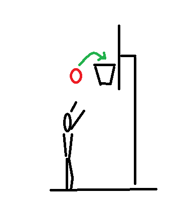

# TisFit pro týden od 8. února 2021
On-line kroužek všestranného cvičení.

<strong style="color: green;">Tato stránka teprve vzniká, určitě se můžete těšit na vylepšení!</strong>

## 1. Aktivita pro tento týden
* Najděte si ve svém okolí hřiště s basketbalovým košem.
* Zkuste během týdne alespoň 40× hodit na basketbalový koš a&nbsp;pokuste se trefit co nejvíc zásahů.
* Pokud se vám nedaří koš zasáhnout, nevadí. Snaha se počítá a&nbsp;chceme po vás prostě 40 poctivých pokusů o&nbsp;zásah.
* Nevadí, že nemáte basketbalový míč. Je jedno, jaký míč či míček použijete — klidně hažte tenisákem nebo třeba zmačkejte staré noviny a vyrobte si „míč“ z nic. Věřím, že nějaký míč, míček či „míč“ doma najdete.

## 2. Výzva pro tento týden &mdash; cvičení doma
* Tento týden zkuste každý den 10 sed-lehů.
* Nohy nechte volně, nezapírejte si je, ať si zacvičí i&nbsp;vaše bříško.

## 3. Vycházka pro tento týden (pro cvičence z&nbsp;Uherského Hradiště)?
* Byli jste někdy na Rochusu? Asi jo. Jestli už je to dávno, nebo jste tam nebyli, zkuste se tam vypravit.

POZOR! Prosím, dodržujte veškerá vládní opatření. Choďte jen v&nbsp;počtu, který aktuální opatření dovolují, snažte se nepotkávat se s&nbsp;dalšími. Noste roušky či respirátory tam, kde je větší pohyb lidí. Cíle volíme tak, aby byli v&nbsp;přírodě v&nbsp;místech, kde je pohyb lidí menší. Ale v&nbsp;hezkých dnech samozřejmě vyráží do přírody hodně lidí, respektujte se navzájem a&nbsp;buďte opatrní!

### Parkování
* Parkovat lze například u&nbsp;Kauflandu. 
* Malé parkoviště je u vodárenské věže pod Rochusem, ale to může být obsazené a&nbsp;je před ním velký kopec — pozor na náledí).
### Co počasí?
* Až k&nbsp;budově Muzea v&nbsp;přírodě Rochus se dostanete „suchou nohou“. Dále ke kapli Sv. Rocha vede široká zpevněná cesta, která také bývá v&nbsp;pohodě schůdná. Ostatní cestičky už bývají hliněné, tam už zvažte dle aktuální nálady, obuvy a&nbsp;po dohodě s&nbsp;rodiči.
### Mapa
* Mapa je tady: https://mapy.cz/s/horubopuda
### Tip: Můžete si po cestě zkusit i&nbsp;[sokolský „korienťák“](https://sites.google.com/sokol.eu/hradistsky-korientak/korien%C5%A5%C3%A1k-2) &mdash; ale pozor, je-li bláto, bude to trochu horší.

## Chcete se potkat či komunikovat alespoň on-line?
* Připravujeme možnost on-line setkávání bez nutnosti registrace — vydržte!

## Co je TisFit?
* Stránka vznikla pro cvičence Sokola Uherské Hradiště jako kompenzace za cvičení v&nbsp;době, kdy cvičení v&nbsp;tělocvičně vládní opatření neumožňují.
* Naše tipy na cvičení ale nabízíme všem bez rozdílu. Přidejte se, sdílejte, šiřte! Jsme tu pro radost z&nbsp;pohybu a&nbsp;máme radost, že s&nbsp;námi cvičíte!
